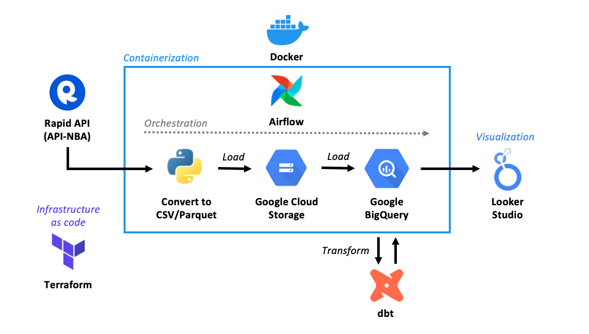
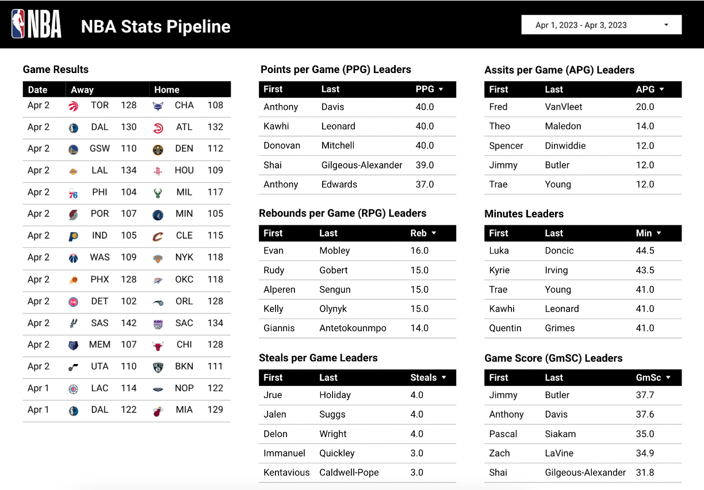

# NBA-Stats-Pipeline #

## Summary
This data pipeline extracts basic NBA data using the [API-NBA](https://rapidapi.com/api-sports/api/api-nba) endpoint hosted on [Rapid API](https://rapidapi.com/). Collected data includes:
- Team data (e.g., name, city, conference, division, etc.)
- Completed NBA games (excludes scheduled and live games)
- Player statistics for each NBA completed NBA game

The final output is a [Looker Studio report](https://lookerstudio.google.com/s/pfKCuj6pvMQ) visualizing the extracted data in BigQuery

## Motivation
The overall motivation for this project was to build an end-to-end ETL data pipeline using real world data. Some of the key objectives I had for completing this project were:
- Complete a full exercise comprising of designing and building out the architecture for an end-to-end ETL data pipeline
- Gain further experience and skills in the common tools used in the modern data stack
- Demonstrate my understanding, technical knowhow, and aptitude as a senior data analyst/data engineer

My goal is to continue to gain experience as a senior data analyst in my next professional role and ultimately transition to a data engineering role.

## Tools & Architecture
Below is the list of tools used and the data pipeline architecture. The pipeline is orchestrated with [Airflow](https://airflow.apache.org) within a [Docker](https://www.docker.com) container.

1. Create GCP resources with [Terraform](https://www.terraform.io)
2. Extract data from [API-NBA](https://rapidapi.com/api-sports/api/api-nba) endpoint hosted on [Rapid API](https://rapidapi.com/)
3. Transform API response data using [Pandas](https://pandas.pydata.org/) and convert to CSV/Parquet files
4. Load parquetized data into [Google Cloud Storage](https://cloud.google.com/storage)
5. Load the data from Google Cloud Storage to [BigQuery Data Warehouse](https://cloud.google.com/bigquery)
6. Perform further transformation with [dbt](https://www.getdbt.com)
7. Visualize extracted data using [Looker Studio](https://cloud.google.com/looker-studio)

   

 

## Output ##
The final output is a [Looker Studio report](https://lookerstudio.google.com/s/pfKCuj6pvMQ) visualizing the data transformed in dbt and loaded in BigQuery. Given the focus of this project was to build a ETL data pipeline from end-to-end, the visualizations in the report are basic. They include:
- The results of the most recent games
- League leaders in:
    - Points per Game (PPG)
    - Assists per Game (APG)
    - Rebounds per Game (RPG)
    - Minutes
    - Steals per Game
    - [Game Score (GmSc)](https://www.nbastuffer.com/analytics101/game-score/)
- GmSc vs. Minutes Scatterplot

  
 

## Data Pipeline Setup
Below are the step-by-step instructions to set up and run this pipeline

> ##WORK  IN PROGRESS##

 

> **NOTE**: This pipeline using an M1 Mac. There may be further configurations and/or set up required to run this data pipeline for Windows, Linux, or any other OS environment.